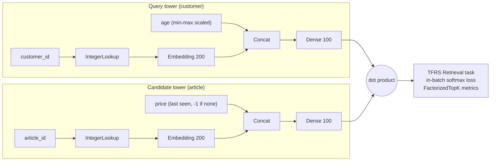

# H&M Personalized Fashion Recommendations - Two-Tower Retrieval (WIP)

A work-in-progress exploration of a **two-tower retrieval model** with
[TensorFlow Recommenders](https://www.tensorflow.org/recommenders) (TFRS) on the data of the Kaggle competition
[H&M Personalized Fashion Recommendations](https://www.kaggle.com/competitions/h-and-m-personalized-fashion-recommendations) (2022).

> **Status:** data preparation, the two towers and a first training run are implemented and executed.
> Hold-out evaluation, candidate indexing and the Kaggle submission are **not done yet**, so there is no
> leaderboard score or retrieval metric to report. See [Next steps](#next-steps).

## The problem

H&M released two years of online purchase history (about 31.8M transactions from 1.37M customers over 105k articles)
together with customer and article metadata and product images. The task: for every customer, predict up to 12 articles
they will buy in the 7 days right after the training data ends. Submissions are scored with MAP@12.

## Why a two-tower model

With ~1.4M customers and ~105k articles, scoring every customer-article pair with a heavy model is too expensive.
Recommender systems usually split the work into two stages:

1. **Retrieval** narrows the full catalogue down to a few hundred plausible candidates per customer, cheaply.
2. **Ranking** re-scores only those candidates with a richer model to pick the final list.

A two-tower model is the standard retrieval approach: one network embeds the customer (query), another embeds the
article (candidate), and relevance is their dot product. Article embeddings can be computed once and put in an
approximate nearest-neighbour index, so retrieving the top-k articles for a customer is a fast lookup.
This repository covers the retrieval stage only.

## Architecture



- **Data preparation:** hexadecimal `customer_id` strings compressed to `int64`, `article_id` to `int32`,
  everything saved as parquet for fast reloads.
- **Training window:** transactions from 2020-09-01 onward (the last three weeks of the data), shuffled into batches of 5,000.
- **Loss:** for each purchase in a batch, the bought article is the positive and the other articles in the batch are the
  negatives (softmax cross-entropy over dot products).
- **Optimizer:** Adagrad, learning rate 0.002, 10 epochs.

## What the committed run shows

The notebook outputs come from the original 2022 run (not re-executed here). Over 10 epochs the training loss decreased
from 42,571.8 to 40,445.1 (133 batches per epoch). The `factorized_top_k/*` columns in the log are all zero because the
model computes those metrics only in evaluation mode (`compute_metrics = not training`) to keep training fast; they are
not a quality measurement. Retrieval quality has not been measured yet.

## Next steps

1. **Validation:** hold out the last week of transactions (the competition horizon), train on the earlier weeks and
   report recall@12 and MAP@12 on the held-out purchases, plus the TFRS top-k metrics via `model.evaluate`.
2. **Indexing:** build a `tfrs.layers.factorized_top_k.ScaNN` index over the article embeddings (with `BruteForce` as a
   correctness baseline) to retrieve 12 articles per customer. An unfinished draft of this and of the submission step
   exists in the git history (commit `6a6c792`).
3. **Submission:** predict for every customer in `sample_submission.csv`, with a fallback (e.g. recent best sellers) for
   customers without recent purchases, restore the original id formats and submit to Kaggle.
4. **Model:** longer history, more features (product type, colour, department, sales channel, recency), and a ranking
   stage on top of the retrieved candidates.

## Running it

The notebook needs the competition data (see [`data/README.md`](data/README.md)) and a machine with plenty of RAM:
the raw transactions frame alone takes over 1.2 GB in pandas.

```bash
python -m venv .venv && source .venv/bin/activate
pip install -r requirements.txt jupyter
# download the CSVs into data/ as described in data/README.md
jupyter notebook retriever_with_features.ipynb
```

`requirements.txt` lists compatible version ranges; the exact 2022 versions were not recorded. TFRS requires Keras 2,
hence TensorFlow < 2.16. On Kaggle, import the notebook, add the competition data and point `DATA_DIR` at
`../input/h-and-m-personalized-fashion-recommendations`.

## Repository structure

```text
.
├── retriever_with_features.ipynb   # data preparation, two-tower model, training
├── data/README.md                  # download commands and expected layout
├── requirements.txt
└── LICENSE
```

## References

- TensorFlow Recommenders: [retrieval tutorial](https://www.tensorflow.org/recommenders/examples/basic_retrieval),
  [API reference](https://www.tensorflow.org/recommenders/api_docs/python/tfrs), [source](https://github.com/tensorflow/recommenders)
- Competition overview, data and evaluation: [Kaggle](https://www.kaggle.com/competitions/h-and-m-personalized-fashion-recommendations)

## License

Code released under the [MIT License](LICENSE). The H&M data belongs to H&M Group and is distributed by Kaggle under the
competition rules; it is not included here.
